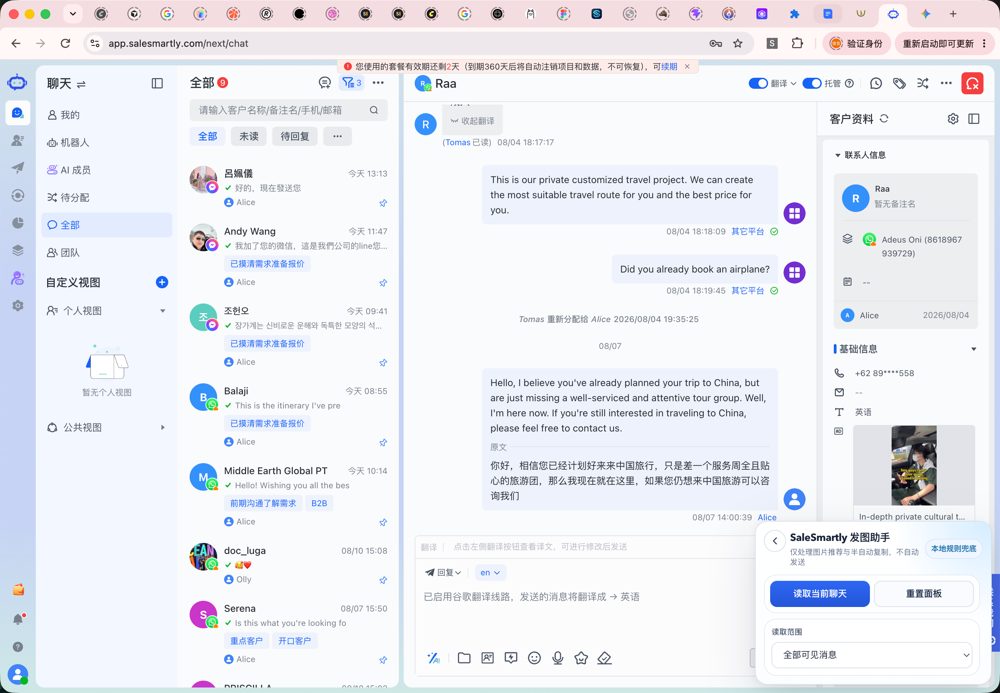
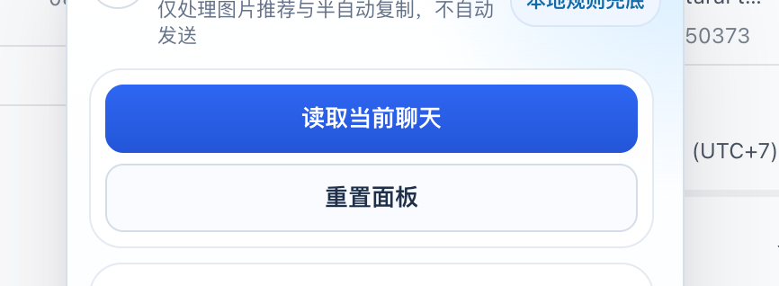
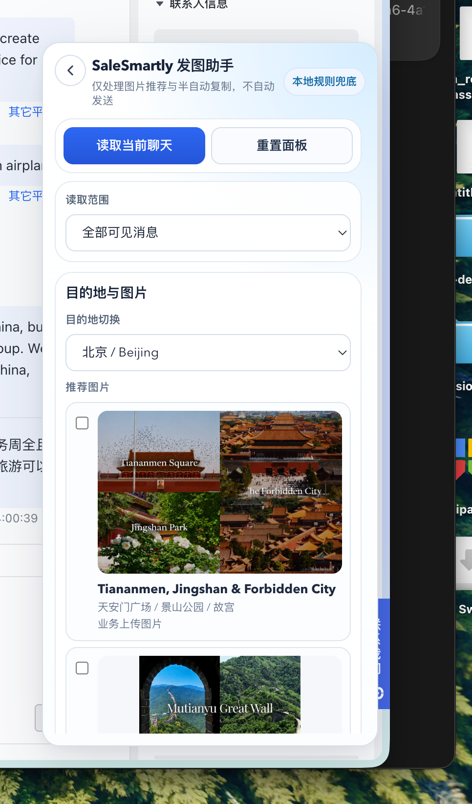

# 发图插件操作说明

更新时间：2026-08-11

## 1. 插件用途

这个插件只做一件事：

- 根据客户聊天内容识别目的地关键词
- 推荐对应目的地图片
- 由业务手动勾选图片
- 逐张复制到剪贴板
- 手动粘贴到 SaleSmartly 对话框

当前版本不做：

- 不自动发送
- 不区分 `family / senior / general`
- 不区分语言标签
- 不自动把多图塞进待发送区

## 2. 安装方式

1. 拿到压缩包 `发图插件.zip`
2. 解压到本地文件夹
3. 打开 Chrome，进入 `chrome://extensions/`
4. 打开右上角“开发者模式”
5. 点击“加载已解压的扩展程序”
6. 选择解压后的插件文件夹

## 3. 初始界面

插件默认停靠在页面右下角。

说明：

- `读取当前聊天`：读取当前会话内容并识别目的地
- `重置面板`：清空当前识别结果，回到初始状态
- `读取范围`：控制读取最近几条消息

## 4. 正常使用流程

### 第一步：打开目标客户聊天

进入 SaleSmartly 的目标客户会话页面，确认当前聊天窗口里有客户真实消息。

### 第二步：点击“读取当前聊天”

插件会根据当前聊天内容识别目的地，并显示推荐图片。

按钮区域如下：

### 第三步：查看识别结果和推荐图片

识别成功后，面板会展开并显示：

- 目的地切换
- 推荐图片列表
- 图片勾选框
- 复制按钮

示例：

### 第四步：勾选需要发送的图片

业务只需要勾选本次要发给客户的图片即可。

建议：

- 只选和客户当前咨询最相关的图
- 不要一次勾选过多无关图片

### 第五步：点击“复制所选内容”

插件会先复制第一张已勾选图片到剪贴板。

然后业务回到 SaleSmartly 输入区：

- Mac：`Cmd + V`
- Windows：`Ctrl + V`

如果勾选了多张图，继续点击：

- `复制下一张已勾选图片`

再逐张粘贴，直到完成。

## 5. 目的地切换

如果插件识别结果不准确，可以手动切换目的地下拉框。

适用场景：

- 客户消息里同时提到多个目的地
- 当前聊天关键词不够清晰
- 业务确认要改发另一个目的地的图片

## 6. 面板拖动规则

为了避免遮挡客户信息，面板支持手动拖动。

当前规则：

- 默认停靠在右下角
- 需要时可以手动拖开
- 面板缩回后会尽量保持底部贴住原位置

建议业务使用方式：

- 只在遮挡客户资料或聊天正文时临时拖开
- 发完图后可继续停在右下角附近，减少来回适应成本

## 7. 推荐操作习惯

建议统一按下面顺序操作：

1. 打开客户聊天
2. 点击 `读取当前聊天`
3. 核对目的地
4. 勾选图片
5. 点击 `复制所选内容`
6. 到输入框手动粘贴
7. 如有多张，继续 `复制下一张已勾选图片`

这样最稳定，也最不容易出错。

## 8. 常见问题

### 1. 为什么没有自动发送？

当前版本只负责“识别和发图辅助”，不负责自动发送，避免误发。

### 2. 为什么一次不能直接把多张图都贴进去？

受当前网页环境和浏览器剪贴板能力限制，稳定方案仍然是逐张复制、逐张粘贴。

### 3. 识别错了怎么办？

直接手动切换目的地即可，不需要重新打开插件。

### 4. 面板挡住了客户信息怎么办？

直接拖动面板到不遮挡的位置，再继续操作。

### 5. 点击读取后没出图怎么办？

先检查：

- 当前聊天里是否有客户消息
- 消息里是否提到了明确目的地
- 该目的地是否已经建好图片库

## 9. 当前产品边界

当前插件已经按最简业务链路收敛为：

- 目的地识别
- 图片推荐
- 手动勾选
- 逐张复制
- 手动粘贴

不再保留多余分支逻辑，方便业务快速上手。

